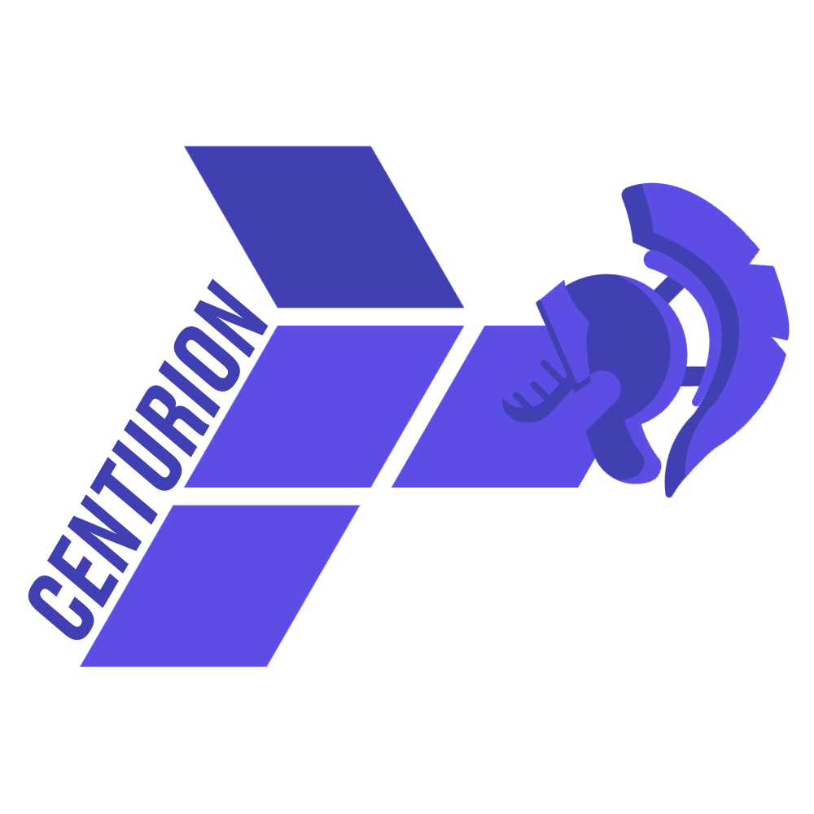

# Centurion

Centurion is a private hosting service offered by the Crossbone non-profit to its members. Since our goal is to simplify
learning all IT-related stuff and helping IT engineers in their career, this repository is made open-source except for
modules that are kept private as-per member requests.

Enjoy!

# Terraform

This repository enables the centurion stack's Infrastructure-as-Code mechanism using Terraform. We use this in cunjunction
to Nix, Nomad and Vault to manage services without requiring imperative management and ensuring it is simple for everyone
to spin up their favorite services or developers environments.

---

## Quickstart

TBD
